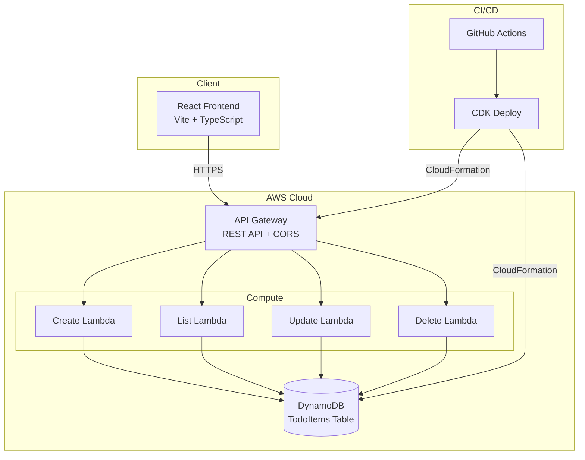
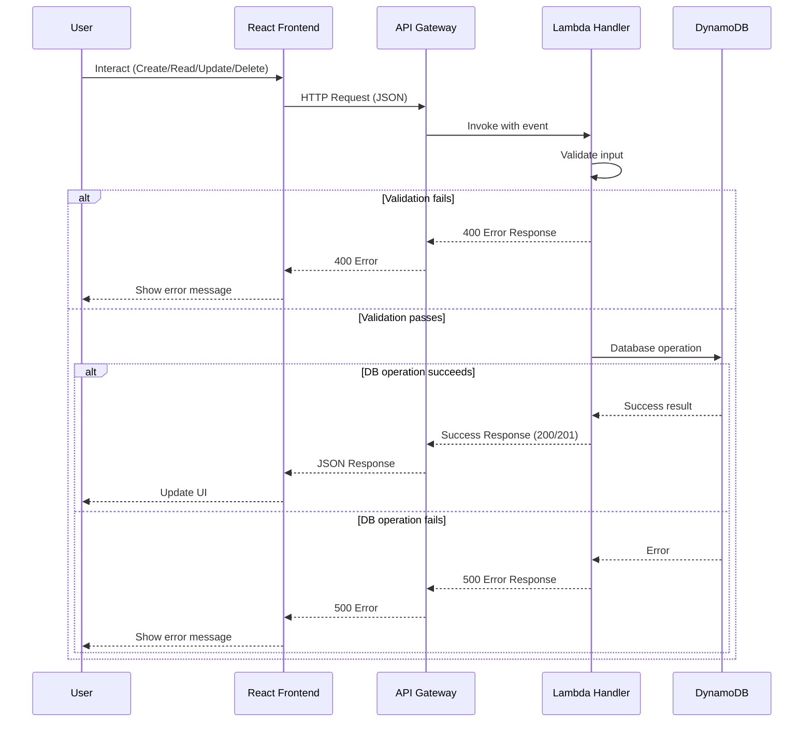
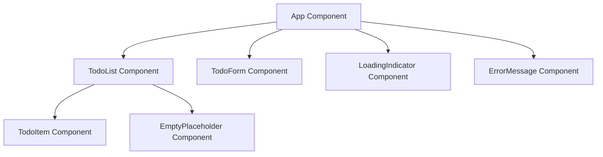
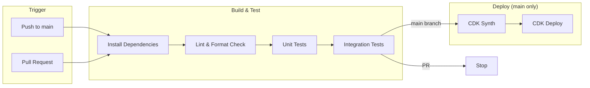
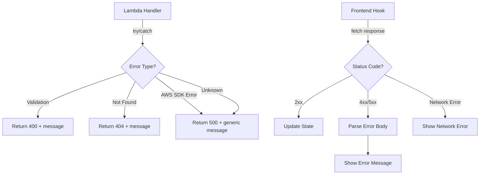

# Technical Design Document

## Overview

This document describes the technical design for a full-stack Todo application built with React (TypeScript) on the frontend, AWS Lambda (TypeScript) on the backend, DynamoDB for persistence, and AWS CDK for infrastructure-as-code. The application supports CRUD operations on todo items, is deployed via GitHub Actions CI/CD, and follows a multi-agent development workflow with steering files.

### Key Design Decisions

| Decision | Choice | Rationale |
|----------|--------|-----------|
| Language | TypeScript (all layers) | Type safety across frontend, backend, and IaC; shared type definitions |
| Frontend Framework | React 18 with Vite | Fast builds, hot module replacement, modern React patterns |
| Backend Runtime | AWS Lambda (Node.js 20) | Serverless, pay-per-use, minimal ops overhead |
| API Layer | AWS API Gateway (REST) | Native Lambda integration, CORS, request validation |
| Database | DynamoDB (on-demand) | Serverless, auto-scaling, low-latency key-value access |
| IaC | AWS CDK v2 (TypeScript) | Programmatic infrastructure, type-safe constructs, reusable patterns |
| Testing | Jest + fast-check | Unit/integration tests with property-based testing for correctness |
| CI/CD | GitHub Actions | Native GitHub integration, free tier for open source |
| Package Manager | npm workspaces | Monorepo management, shared dependencies, unified scripts |

### Research Summary

- **React architecture**: Component-based architecture with clear separation of concerns (UI components, hooks for state/API, services for HTTP calls). Adopted a feature-based directory structure for maintainability. ([Source: MDN Web Docs](https://developer.mozilla.org/en-US/docs/Learn_web_development/Core/Frameworks_libraries/React_todo_list_beginning))
- **AWS CDK best practices**: Resources organized into logical constructs, least-privilege IAM, environment variables for configuration, separate stacks for different stages. ([Source: AWS CDK Best Practices](https://docs.aws.amazon.com/cdk/v2/guide/best-practices.html))
- **OpenAPI 3.0**: Standard interface description for HTTP APIs with schema definitions, examples, and error response documentation. ([Source: OpenAPI Specification](https://spec.openapis.org/oas/v3.0.3))

Content was rephrased for compliance with licensing restrictions.

---

## Architecture

### High-Level System Architecture



### Request Flow



---

## Components and Interfaces

### Frontend Components



| Component | Responsibility | Props |
|-----------|---------------|-------|
| `App` | Root component, manages global state and API calls | None |
| `TodoList` | Renders list of todo items | `items: TodoItem[]`, `onToggle`, `onDelete`, `onEdit` |
| `TodoItem` | Renders single todo with edit/toggle/delete controls | `item: TodoItem`, `onToggle`, `onDelete`, `onEdit` |
| `TodoForm` | Input form for creating new todos | `onSubmit`, `disabled: boolean` |
| `LoadingIndicator` | Shown during API calls | `isLoading: boolean` |
| `ErrorMessage` | Displays API errors with dismiss | `message: string`, `onDismiss` |
| `EmptyPlaceholder` | Shown when no todos exist | None |

### Frontend Hooks

| Hook | Purpose |
|------|---------|
| `useTodos` | Manages todo state, CRUD operations, loading/error states |
| `useApi` | Wraps fetch calls with error handling, timeout (30s), loading state |

### Frontend Services

| Service | Purpose |
|---------|---------|
| `todoApi` | HTTP client for all API endpoints (GET, POST, PUT, DELETE) |

### Backend Lambda Handlers

| Handler | Method | Path | Purpose |
|---------|--------|------|---------|
| `createTodo` | POST | `/todos` | Create a new todo item |
| `listTodos` | GET | `/todos` | List all todo items (max 100, sorted by createdAt desc) |
| `updateTodo` | PUT | `/todos/{id}` | Update specified fields of a todo item |
| `deleteTodo` | DELETE | `/todos/{id}` | Delete a todo item by id |

### Backend Shared Modules

| Module | Purpose |
|--------|---------|
| `validator` | Input validation (title length, description length, required fields) |
| `serializer` | JSON serialization/deserialization of TodoItem with type enforcement |
| `dynamodb-client` | DynamoDB DocumentClient wrapper with error handling |
| `response` | HTTP response builder (status codes, headers, JSON body) |

### Interface Contracts

#### POST /todos

**Request:**
```json
{
  "title": "string (1-255 chars, required)",
  "description": "string (0-1024 chars, optional)"
}
```

**Response (201):**
```json
{
  "id": "uuid-v4",
  "title": "string",
  "description": "string | null",
  "status": "incomplete",
  "createdAt": "ISO 8601 UTC",
  "updatedAt": "ISO 8601 UTC"
}
```

#### GET /todos

**Response (200):**
```json
[
  {
    "id": "uuid-v4",
    "title": "string",
    "description": "string | null",
    "status": "incomplete | complete",
    "createdAt": "ISO 8601 UTC",
    "updatedAt": "ISO 8601 UTC"
  }
]
```

#### PUT /todos/{id}

**Request:**
```json
{
  "title": "string (1-255 chars, optional)",
  "description": "string (0-1024 chars, optional)",
  "status": "incomplete | complete (optional)"
}
```

**Response (200):**
```json
{
  "id": "uuid-v4",
  "title": "string",
  "description": "string | null",
  "status": "incomplete | complete",
  "createdAt": "ISO 8601 UTC",
  "updatedAt": "ISO 8601 UTC"
}
```

#### DELETE /todos/{id}

**Response (200):**
```json
{
  "id": "uuid-v4"
}
```

#### Error Response Format (all errors)

```json
{
  "error": true,
  "message": "Human-readable error description"
}
```

---

## Data Models

### TodoItem Schema

```typescript
interface TodoItem {
  id: string;          // UUID v4, partition key
  title: string;       // 1-255 characters (trimmed)
  description: string | null;  // 0-1024 characters, null if not provided
  status: "incomplete" | "complete";  // Default: "incomplete"
  createdAt: string;   // ISO 8601 UTC timestamp
  updatedAt: string;   // ISO 8601 UTC timestamp
}
```

### DynamoDB Table Design

| Attribute | Type | Key |
|-----------|------|-----|
| `id` | String (UUID v4) | Partition Key |
| `title` | String | - |
| `description` | String (nullable) | - |
| `status` | String (`incomplete` \| `complete`) | - |
| `createdAt` | String (ISO 8601) | - |
| `updatedAt` | String (ISO 8601) | - |

**Table Configuration:**
- Billing mode: On-demand (PAY_PER_REQUEST)
- No sort key (single-item access by id)
- No Global Secondary Indexes (list queries use Scan with Limit of 100)

### Validation Rules

| Field | Rule | Error |
|-------|------|-------|
| `title` | Required, 1-255 chars after trim | "A non-empty title is required" / "Title must not exceed 255 characters" |
| `description` | Optional, max 1024 chars | "Description must not exceed 1024 characters" |
| `status` | Must be "incomplete" or "complete" | "Status must be 'incomplete' or 'complete'" |
| `id` (path param) | Valid UUID v4 format | "Invalid id format" |

### API Request Schemas

```typescript
interface CreateTodoRequest {
  title: string;           // Required
  description?: string;    // Optional
}

interface UpdateTodoRequest {
  title?: string;          // Optional
  description?: string;    // Optional
  status?: "incomplete" | "complete";  // Optional
}
// At least one field must be provided
```

### CDK Infrastructure Components

```mermaid
graph TB
    subgraph "TodoAppStack"
        Table[DynamoDB Table<br/>TodoItems]
        
        subgraph "API Construct"
            API[REST API<br/>CORS enabled]
            TodosResource[/todos Resource]
            TodoIdResource[/todos/{id} Resource]
        end
        
        subgraph "Lambda Functions"
            CreateFn[createTodo<br/>256MB / 30s]
            ListFn[listTodos<br/>256MB / 30s]
            UpdateFn[updateTodo<br/>256MB / 30s]
            DeleteFn[deleteTodo<br/>256MB / 30s]
        end
    end
    
    API --> TodosResource
    API --> TodoIdResource
    TodosResource -->|POST| CreateFn
    TodosResource -->|GET| ListFn
    TodoIdResource -->|PUT| UpdateFn
    TodoIdResource -->|DELETE| DeleteFn
    CreateFn -->|read-write| Table
    ListFn -->|read-only| Table
    UpdateFn -->|read-write| Table
    DeleteFn -->|read-write| Table
```

### Project Directory Structure

```
todo-app-multi-agent/
├── .kiro/
│   ├── steering/
│   │   └── project-standards.md
│   └── specs/
│       └── todo-app-multi-agent/
│           ├── .config.kiro
│           ├── requirements.md
│           ├── design.md
│           └── tasks.md
├── frontend/
│   ├── src/
│   │   ├── components/
│   │   │   ├── App.tsx
│   │   │   ├── TodoList.tsx
│   │   │   ├── TodoItem.tsx
│   │   │   ├── TodoForm.tsx
│   │   │   ├── LoadingIndicator.tsx
│   │   │   ├── ErrorMessage.tsx
│   │   │   └── EmptyPlaceholder.tsx
│   │   ├── hooks/
│   │   │   ├── useTodos.ts
│   │   │   └── useApi.ts
│   │   ├── services/
│   │   │   └── todoApi.ts
│   │   ├── types/
│   │   │   └── todo.ts
│   │   ├── main.tsx
│   │   └── index.html
│   ├── tests/
│   │   ├── components/
│   │   └── hooks/
│   ├── package.json
│   ├── tsconfig.json
│   └── vite.config.ts
├── backend/
│   ├── src/
│   │   ├── handlers/
│   │   │   ├── createTodo.ts
│   │   │   ├── listTodos.ts
│   │   │   ├── updateTodo.ts
│   │   │   └── deleteTodo.ts
│   │   ├── lib/
│   │   │   ├── validator.ts
│   │   │   ├── serializer.ts
│   │   │   ├── dynamodb-client.ts
│   │   │   └── response.ts
│   │   └── types/
│   │       └── todo.ts
│   ├── tests/
│   │   ├── unit/
│   │   │   ├── handlers/
│   │   │   ├── lib/
│   │   │   └── properties/
│   │   └── integration/
│   ├── package.json
│   └── tsconfig.json
├── infrastructure/
│   ├── lib/
│   │   └── todo-app-stack.ts
│   ├── bin/
│   │   └── app.ts
│   ├── test/
│   │   └── todo-app-stack.test.ts
│   ├── package.json
│   ├── tsconfig.json
│   └── cdk.json
├── docs/
│   ├── openapi.yaml
│   └── multi-agent-workflow.md
├── .github/
│   └── workflows/
│       └── ci-cd.yml
├── package.json
├── tsconfig.base.json
└── README.md
```

### CI/CD Pipeline Architecture



**Pipeline Steps:**
1. **Trigger**: On push to `main` or PR targeting `main`
2. **Install**: `npm ci` at workspace root (installs all packages)
3. **Lint**: ESLint + Prettier check across all packages
4. **Unit Tests**: Jest runs frontend + backend unit tests (including property tests)
5. **Integration Tests**: API endpoint tests against local/mocked Lambda
6. **CDK Synth** (main only): Synthesize CloudFormation template
7. **CDK Deploy** (main only): Deploy stack to AWS
8. **Timeout**: 30-minute maximum pipeline duration

---


## Correctness Properties

*A property is a characteristic or behavior that should hold true across all valid executions of a system—essentially, a formal statement about what the system should do. Properties serve as the bridge between human-readable specifications and machine-verifiable correctness guarantees.*

### Property 1: Create handler produces well-formed TodoItem

*For any* valid title (1-255 non-whitespace characters after trimming) and any optional description (0-1024 characters), when the create handler is invoked, it SHALL return a TodoItem where: the id is a valid UUID v4, the title matches the trimmed input, the description matches the input or is null, the status is "incomplete", and both createdAt and updatedAt are valid ISO 8601 UTC timestamps.

**Validates: Requirements 1.2**

### Property 2: Title validation rejects invalid inputs

*For any* string that, after trimming leading and trailing whitespace, has length 0 (empty or whitespace-only) or length greater than 255 characters, the backend validation SHALL reject the input with a 400 status code. Conversely, *for any* string that after trimming has length between 1 and 255 characters, the validation SHALL accept the input.

**Validates: Requirements 1.4, 3.7, 11.6, 12.1**

### Property 3: Description validation enforces length limit

*For any* string with length greater than 1024 characters provided as a description, the backend validation SHALL reject the input with a 400 status code. *For any* string with length between 0 and 1024 characters, the validation SHALL accept the input.

**Validates: Requirements 12.2**

### Property 4: List returns items sorted by createdAt descending and capped at 100

*For any* collection of TodoItems stored in the database, the list handler SHALL return items sorted such that for any two consecutive items in the result, the first item's createdAt timestamp is greater than or equal to the second item's createdAt timestamp. Additionally, the result SHALL contain at most 100 items regardless of how many exist in the database.

**Validates: Requirements 2.2**

### Property 5: Update preserves unspecified fields

*For any* existing TodoItem and any valid subset of updatable fields (title, description, status) where at least one field is provided, after invoking the update handler, all fields NOT included in the update request SHALL retain their original values, and the updatedAt timestamp SHALL be different from the original.

**Validates: Requirements 3.2**

### Property 6: Delete removes item from storage

*For any* TodoItem that exists in the database, after invoking the delete handler with that item's id, querying the database for that id SHALL return no result.

**Validates: Requirements 4.2**

### Property 7: ID format validation rejects malformed identifiers

*For any* string that does not conform to UUID v4 format (pattern: 8-4-4-4-12 hexadecimal characters with version 4 indicator), the backend SHALL reject the request with a 400 status code.

**Validates: Requirements 4.6**

### Property 8: TodoItem serialization round-trip

*For any* valid TodoItem (with valid id, title, description, status, createdAt, updatedAt), serializing the item to JSON and deserializing the result back SHALL produce a TodoItem with identical field values and types.

**Validates: Requirements 12.4, 12.6, 12.7**

### Property 9: Invalid JSON rejection

*For any* string that is not valid JSON, when sent as a request body to any endpoint that expects JSON input, the backend SHALL reject the request with a 400 status code and an error message indicating a parsing error.

**Validates: Requirements 12.5**

### Property 10: Frontend renders all TodoItem data

*For any* non-empty array of TodoItems passed to the TodoList component, each item's title, description (when not null), and status SHALL be present in the rendered output.

**Validates: Requirements 2.5**

### Property 11: Frontend TodoItem controls and completion styling

*For any* TodoItem rendered in the frontend, the component SHALL display edit, toggle, and delete controls. Additionally, *for any* TodoItem with status "complete", the title SHALL have strikethrough styling applied.

**Validates: Requirements 11.2, 11.3**

---

## Error Handling

### Backend Error Strategy

| Error Type | HTTP Status | Response Format | Trigger |
|-----------|-------------|-----------------|---------|
| Missing required field | 400 | `{ "error": true, "message": "A non-empty title is required" }` | POST/PUT without valid title |
| Validation failure | 400 | `{ "error": true, "message": "Title must not exceed 255 characters" }` | Field exceeds limits |
| Invalid JSON body | 400 | `{ "error": true, "message": "Request body must be valid JSON" }` | Malformed request body |
| Empty update | 400 | `{ "error": true, "message": "At least one updatable field must be provided" }` | PUT with no recognized fields |
| Invalid ID format | 400 | `{ "error": true, "message": "Invalid id format" }` | Non-UUID path parameter |
| Resource not found | 404 | `{ "error": true, "message": "No todo item found with id: {id}" }` | PUT/DELETE with non-existent id |
| DynamoDB service error | 500 | `{ "error": true, "message": "Internal server error" }` | AWS SDK throws |

### Frontend Error Strategy

| Scenario | Behavior |
|----------|----------|
| API returns 4xx | Display error message from response body, keep current state |
| API returns 5xx | Display generic "Server error, please try again" message |
| Network timeout (30s) | Display "Request timed out, please try again" message |
| Network failure | Display "Unable to connect to server" message |
| Error dismissal | User can dismiss error by clicking dismiss or initiating new action |

### Error Propagation Flow



---

## Testing Strategy

### Unit Testing

**Frontend (Jest + React Testing Library):**
- Component rendering tests for each component
- Hook behavior tests (useTodos, useApi)
- Service layer tests with mocked fetch
- Coverage target: 80% line, 70% branch

**Backend (Jest + mocked AWS SDK):**
- Handler tests for each Lambda (success and error paths)
- Validator module tests (valid/invalid inputs)
- Serializer module tests (serialization/deserialization)
- Response builder tests
- Coverage target: 80% line, 70% branch

**Infrastructure (Jest + CDK assertions):**
- Stack synthesis validation
- Resource property assertions (memory, timeout, billing mode)
- IAM permission assertions
- CORS configuration assertions

### Property-Based Testing (fast-check)

**Library:** [fast-check](https://github.com/dubzzz/fast-check) — TypeScript property-based testing library

**Configuration:**
- Minimum 100 iterations per property test
- Each test tagged with: `Feature: todo-app-multi-agent, Property {N}: {title}`

**Property tests to implement:**

| Property | Module Under Test | Generator Strategy |
|----------|-------------------|-------------------|
| Property 1: Create handler | `createTodo` handler | Random valid titles (1-255 chars) + optional descriptions (0-1024 chars) |
| Property 2: Title validation | `validator.validateTitle` | Random strings (empty, whitespace, valid, oversized) |
| Property 3: Description validation | `validator.validateDescription` | Random strings (valid length, oversized) |
| Property 4: List sorting/limit | `listTodos` handler | Random arrays of TodoItems with random timestamps |
| Property 5: Update preservation | `updateTodo` handler | Random existing items + random field subsets |
| Property 6: Delete removes | `deleteTodo` handler | Random existing items |
| Property 7: ID validation | `validator.validateId` | Random strings (valid UUIDs, invalid strings) |
| Property 8: Serialization round-trip | `serializer` module | Random valid TodoItems |
| Property 9: Invalid JSON | Request parsing | Random non-JSON strings |
| Property 10: Frontend rendering | `TodoList` component | Random TodoItem arrays |
| Property 11: Controls/styling | `TodoItem` component | Random TodoItems with varying status |

### Integration Testing

**Strategy:** Test API endpoints with a local DynamoDB (DynamoDB Local or mocked client)

**Test scenarios:**
1. Full CRUD lifecycle (create → read → update → delete)
2. Error scenarios (missing title, non-existent id, malformed id)
3. Data isolation between tests (each test starts with clean state)
4. Response format validation against OpenAPI spec

### Test Execution

```bash
# Unit tests (including property tests)
npm run test:unit

# Integration tests
npm run test:integration

# All tests with coverage
npm run test:coverage

# Property tests only
npm run test:properties
```
